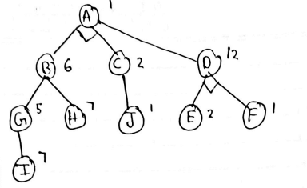

## AO* Algorithm Explanation

The AO* (AO Star) algorithm, which is a variation of the A* search algorithm. AO* is used to find the optimal path from a starting node to a goal node in a graph. It considers both the cost of reaching each node and a heuristic estimate of the cost to the goal. Here's a breakdown of the implementation:

<p><b>What is difference between A * and AO * algorithm?</b><br>
An A* algorithm represents an OR graph algorithm that is used to find a single solution (either this or that). An AO* algorithm represents an AND-OR graph algorithm that is used to find more than one solution by ANDing more than one branch.</p>

#### Real-life Examples
<ul>
    <li>Maps</li>
    <li>Games</li>
</ul>

#### Formula for AO* Algorithm
```python
h(n) = heuristic_value
g(n) = actual_cost
f(n) = actual_cost + heursitic_value
```
```python
f(n) = g(n) + h(n)
```

### Class Definition (`Graph`)

The code defines a class called `Graph` to encapsulate the logic of the AO* algorithm.

### Constructor (`__init__` method)

The constructor initializes the `Graph` object with the following parameters:
- `graph`: Represents the graph structure as a dictionary, with nodes as keys and lists of neighboring nodes along with associated costs as values.
- `heuristicNodeList`: A dictionary containing heuristic values for each node in the graph.
- `startNode`: The starting node for the search.

The constructor also initializes various data structures, including the graph itself (`self.graph`), heuristic values (`self.H`), the starting node (`self.start`), parent nodes (`self.parent`), node status (`self.status`), and the solution graph (`self.solutionGraph`).

### Method: `applyAOStar(self)`

This method is the entry point for the AO* algorithm. It initiates the search by calling the `aoStar` method with the starting node and a flag indicating no backtracking (`backTracking=False`).

### Methods for Graph Operations

- `getNeighbors(self, v)`: Returns the neighboring nodes of a given node `v`.
- `getStatus(self, v)`: Returns the status of a given node `v`.
- `setStatus(self, v, val)`: Sets the status of a given node to the provided value `val`.

### Methods for Heuristic Values

- `getHeuristicNodeValue(self, n)`: Retrieves the heuristic value of a given node `n`.
- `setHeuristicNodeValue(self, n, value)`: Sets or updates the heuristic value of a given node `n`.

### Method: `computeMinimumCostChildNodes(self, v)`

This method computes the minimum cost and the child nodes with their associated costs for a given node `v`. It iterates through the neighboring nodes, calculating the cost based on heuristic values and edge weights.

### Method: `aoStar(self, v, backTracking)`

The core of the AO* algorithm.
- `v`: The current node being processed.
- `backTracking`: A flag indicating whether the method is called during backtracking.

This method performs the following steps:
- If the node `v` is not already solved, it calculates the minimum cost and associated child nodes.
- It updates the heuristic value of `v` with the minimum cost.
- It marks nodes as "solved" if they have been processed, and all their minimum cost child nodes are solved.
- If all minimum cost child nodes of `v` are solved, it sets the status of `v` to -1, indicating it is solved.
- It updates the `solutionGraph` with the solved nodes, which may be part of the solution.
- If `v` is not the start node, it recursively calls `aoStar` on the parent node with `backTracking=True`.
- If `backTracking` is False, it resets the status of child nodes and continues exploring them.

### Method: `printSolution`

This method is used to print the solution graph, which represents the path from the start node to the goal. It prints the solution graph and nodes traversed from the start node.

### Example Usage (G1 and G2)

Two example instances of the `Graph` class (`G1` and `G2`) are created with different graph structures and heuristic values.
The `applyAOStar` method is called on these instances to apply the AO* algorithm.
The `printSolution` method is used to print the results.

In summary, the AO* algorithm is a variation of A* that uses a heuristic estimate of the cost to reach the goal node from each node. It explores the graph while considering both the cost to reach each node and the heuristic values. The code you provided implements this algorithm for two different graphs and prints the solution path from the start node to the goal node.
```python
class Graph:
    def __init__(self, graph, heuristicNodeList, startNode):
        self.graph = graph
        self.H = heuristicNodeList
        self.start = startNode
        self.parent = {}
        self.status = {}
        self.solutionGraph = {}

    def applyAOStar(self):  # starts a recursive AO* algorithm
        self.aoStar(self.start, False)

    def getNeighbors(self, v):  # gets the Neighbors of a given node
        return self.graph.get(v, '')

    def getStatus(self, v):  # return the status of a given node
        return self.status.get(v, 0)

    def setStatus(self, v, val):  # set the status of a given node
        self.status[v] = val

    def getHeuristicNodeValue(self, n):
        return self.H.get(n, 0)  # always return the heuristic value of a given node

    def setHeuristicNodeValue(self, n, value):
        self.H[n] = value  # set the revised heuristic value of a given node

    def printSolution(self):
        print("FOR GRAPH SOLUTION, TRAVERSE THE GRAPH FROM THE STARTNODE:", self.start)
        print("----------------------------------------------------------")
        print(self.solutionGraph)
        print("----------------------------------------------------------")

    def computeMinimumCostChildNodes(self, v):
        minimumCost = 0
        costToChildNodeListDict = {}
        costToChildNodeListDict[minimumCost] = []
        flag = True
        for nodeInfoTupleList in self.getNeighbors(v):
            cost = 0
            nodeList = []
            for c, weight in nodeInfoTupleList:
                cost = cost + self.getHeuristicNodeValue(c) + weight
                nodeList.append(c)
            if flag == True:
                minimumCost = cost
                costToChildNodeListDict[minimumCost] = nodeList
                flag = False
            else:
                if minimumCost > cost:
                    minimumCost = cost
                    costToChildNodeListDict[minimumCost] = nodeList
        return minimumCost, costToChildNodeListDict[minimumCost]

    def aoStar(self, v, backTracking):
        print("HEURISTIC VALUES :", self.H)
        print("SOLUTION GRAPH :", self.solutionGraph)
        print("PROCESSING NODE :", v)
        print("----------------------------------------------------------")

        if self.getStatus(v) >= 0:
            minimumCost, childNodeList = self.computeMinimumCostChildNodes(v)
            self.setHeuristicNodeValue(v, minimumCost)
            self.setStatus(v, len(childNodeList))
            solved = True  # check the Minimum Cost nodes of v are solved

            for childNode in childNodeList:
                self.parent[childNode] = v
                if self.getStatus(childNode) != -1:
                    solved = solved & False
            if solved == True:  # if the Minimum Cost nodes of v are solved, set the  current node status as solved(-1)
                self.setStatus(v, -1)
                self.solutionGraph[v] = childNodeList  # update the solution graph with thesolved nodes which may be a part of solution
            if v != self.start:
                self.aoStar(self.parent[v], True)
            if backTracking == False:  # check the current call is not for backtracking
                for childNode in childNodeList:
                    self.setStatus(childNode, 0)
                    self.aoStar(childNode, False)

h1 = {'A': 1, 'B': 6, 'C': 2, 'D': 12, 'E': 2, 'F': 1, 'G': 5, 'H': 7, 'I': 7, 'J': 1}
graph1 = {
    'A': [[('B', 1), ('C', 1)], [('D', 1)]],
    'B': [[('G', 1)], [('H', 1)]],
    'C': [[('J', 1)]],
    'D': [[('E', 1), ('F', 1)]],
    'G': [[('I', 1)]]
}
G1 = Graph(graph1, h1, 'A')
G1.applyAOStar()
G1.printSolution()
h2 = {'A': 1, 'B': 6, 'C': 12, 'D': 10, 'E': 4, 'F': 4, 'G': 5, 'H': 7}  # Heuristic

graph2 = {
    'A': [[('B', 1), ('C', 1)], [('D', 1)]],
    'B': [[('G', 1)], [('H', 1)]],
    'D': [[('E', 1), ('F', 1)]]
}
G2 = Graph(graph2, h2, 'A')
G2.applyAOStar()
G2.printSolution()

```

<center>


<br>Graph
</center>

```shell
HEURISTIC VALUES : {'A': 1, 'B': 6, 'C': 2, 'D': 12, 'E': 2, 'F': 1, 'G': 5, 'H': 7, 'I': 7, 'J': 1}
SOLUTION GRAPH : {}
PROCESSING NODE : A
----------------------------------------------------------
HEURISTIC VALUES : {'A': 10, 'B': 6, 'C': 2, 'D': 12, 'E': 2, 'F': 1, 'G': 5, 'H': 7, 'I': 7, 'J': 1}
SOLUTION GRAPH : {}
PROCESSING NODE : B
----------------------------------------------------------
HEURISTIC VALUES : {'A': 10, 'B': 6, 'C': 2, 'D': 12, 'E': 2, 'F': 1, 'G': 5, 'H': 7, 'I': 7, 'J': 1}
SOLUTION GRAPH : {}
PROCESSING NODE : A
----------------------------------------------------------
HEURISTIC VALUES : {'A': 10, 'B': 6, 'C': 2, 'D': 12, 'E': 2, 'F': 1, 'G': 5, 'H': 7, 'I': 7, 'J': 1}
SOLUTION GRAPH : {}
PROCESSING NODE : G
----------------------------------------------------------
HEURISTIC VALUES : {'A': 10, 'B': 6, 'C': 2, 'D': 12, 'E': 2, 'F': 1, 'G': 8, 'H': 7, 'I': 7, 'J': 1}
SOLUTION GRAPH : {}
PROCESSING NODE : B
----------------------------------------------------------
HEURISTIC VALUES : {'A': 10, 'B': 8, 'C': 2, 'D': 12, 'E': 2, 'F': 1, 'G': 8, 'H': 7, 'I': 7, 'J': 1}
SOLUTION GRAPH : {}
PROCESSING NODE : A
----------------------------------------------------------
HEURISTIC VALUES : {'A': 12, 'B': 8, 'C': 2, 'D': 12, 'E': 2, 'F': 1, 'G': 8, 'H': 7, 'I': 7, 'J': 1}
SOLUTION GRAPH : {}
PROCESSING NODE : I
----------------------------------------------------------
HEURISTIC VALUES : {'A': 12, 'B': 8, 'C': 2, 'D': 12, 'E': 2, 'F': 1, 'G': 8, 'H': 7, 'I': 0, 'J': 1}
SOLUTION GRAPH : {'I': []}
PROCESSING NODE : G
----------------------------------------------------------
HEURISTIC VALUES : {'A': 12, 'B': 8, 'C': 2, 'D': 12, 'E': 2, 'F': 1, 'G': 1, 'H': 7, 'I': 0, 'J': 1}
SOLUTION GRAPH : {'I': [], 'G': ['I']}
PROCESSING NODE : B
----------------------------------------------------------
HEURISTIC VALUES : {'A': 12, 'B': 2, 'C': 2, 'D': 12, 'E': 2, 'F': 1, 'G': 1, 'H': 7, 'I': 0, 'J': 1}
SOLUTION GRAPH : {'I': [], 'G': ['I'], 'B': ['G']}
PROCESSING NODE : A
----------------------------------------------------------
HEURISTIC VALUES : {'A': 6, 'B': 2, 'C': 2, 'D': 12, 'E': 2, 'F': 1, 'G': 1, 'H': 7, 'I': 0, 'J': 1}
SOLUTION GRAPH : {'I': [], 'G': ['I'], 'B': ['G']}
PROCESSING NODE : C
----------------------------------------------------------
HEURISTIC VALUES : {'A': 6, 'B': 2, 'C': 2, 'D': 12, 'E': 2, 'F': 1, 'G': 1, 'H': 7, 'I': 0, 'J': 1}
SOLUTION GRAPH : {'I': [], 'G': ['I'], 'B': ['G']}
PROCESSING NODE : A
----------------------------------------------------------
HEURISTIC VALUES : {'A': 6, 'B': 2, 'C': 2, 'D': 12, 'E': 2, 'F': 1, 'G': 1, 'H': 7, 'I': 0, 'J': 1}
SOLUTION GRAPH : {'I': [], 'G': ['I'], 'B': ['G']}
PROCESSING NODE : J
----------------------------------------------------------
HEURISTIC VALUES : {'A': 6, 'B': 2, 'C': 2, 'D': 12, 'E': 2, 'F': 1, 'G': 1, 'H': 7, 'I': 0, 'J': 0}
SOLUTION GRAPH : {'I': [], 'G': ['I'], 'B': ['G'], 'J': []}
PROCESSING NODE : C
----------------------------------------------------------
HEURISTIC VALUES : {'A': 6, 'B': 2, 'C': 1, 'D': 12, 'E': 2, 'F': 1, 'G': 1, 'H': 7, 'I': 0, 'J': 0}
SOLUTION GRAPH : {'I': [], 'G': ['I'], 'B': ['G'], 'J': [], 'C': ['J']}
PROCESSING NODE : A
----------------------------------------------------------
FOR GRAPH SOLUTION, TRAVERSE THE GRAPH FROM THE STARTNODE: A
----------------------------------------------------------
{'I': [], 'G': ['I'], 'B': ['G'], 'J': [], 'C': ['J'], 'A': ['B', 'C']}
----------------------------------------------------------
HEURISTIC VALUES : {'A': 1, 'B': 6, 'C': 12, 'D': 10, 'E': 4, 'F': 4, 'G': 5, 'H': 7}
SOLUTION GRAPH : {}
PROCESSING NODE : A
----------------------------------------------------------
HEURISTIC VALUES : {'A': 11, 'B': 6, 'C': 12, 'D': 10, 'E': 4, 'F': 4, 'G': 5, 'H': 7}
SOLUTION GRAPH : {}
PROCESSING NODE : D
----------------------------------------------------------
HEURISTIC VALUES : {'A': 11, 'B': 6, 'C': 12, 'D': 10, 'E': 4, 'F': 4, 'G': 5, 'H': 7}
SOLUTION GRAPH : {}
PROCESSING NODE : A
----------------------------------------------------------
HEURISTIC VALUES : {'A': 11, 'B': 6, 'C': 12, 'D': 10, 'E': 4, 'F': 4, 'G': 5, 'H': 7}
SOLUTION GRAPH : {}
PROCESSING NODE : E
----------------------------------------------------------
HEURISTIC VALUES : {'A': 11, 'B': 6, 'C': 12, 'D': 10, 'E': 0, 'F': 4, 'G': 5, 'H': 7}
SOLUTION GRAPH : {'E': []}
PROCESSING NODE : D
----------------------------------------------------------
HEURISTIC VALUES : {'A': 11, 'B': 6, 'C': 12, 'D': 6, 'E': 0, 'F': 4, 'G': 5, 'H': 7}
SOLUTION GRAPH : {'E': []}
PROCESSING NODE : A
----------------------------------------------------------
HEURISTIC VALUES : {'A': 7, 'B': 6, 'C': 12, 'D': 6, 'E': 0, 'F': 4, 'G': 5, 'H': 7}
SOLUTION GRAPH : {'E': []}
PROCESSING NODE : F
----------------------------------------------------------
HEURISTIC VALUES : {'A': 7, 'B': 6, 'C': 12, 'D': 6, 'E': 0, 'F': 0, 'G': 5, 'H': 7}
SOLUTION GRAPH : {'E': [], 'F': []}
PROCESSING NODE : D
----------------------------------------------------------
HEURISTIC VALUES : {'A': 7, 'B': 6, 'C': 12, 'D': 2, 'E': 0, 'F': 0, 'G': 5, 'H': 7}
SOLUTION GRAPH : {'E': [], 'F': [], 'D': ['E', 'F']}
PROCESSING NODE : A
----------------------------------------------------------
FOR GRAPH SOLUTION, TRAVERSE THE GRAPH FROM THE STARTNODE: A
----------------------------------------------------------
{'E': [], 'F': [], 'D': ['E', 'F'], 'A': ['D']}
----------------------------------------------------------
```
## Bit Detailed
### Graph Class
- **Definition:** Defines a Python class named `Graph` to encapsulate the AO* algorithm's logic.

- **Constructor:** 
  - Initializes a new `Graph` object with the provided `graph`, `heuristicNodeList`, and `startNode`.
  - `self.graph = graph`: Assigns the `graph` parameter to the instance variable `self.graph`.
  - `self.H = heuristicNodeList`: Assigns the `heuristicNodeList` parameter to the instance variable `self.H`.
  - `self.start = startNode`: Assigns the `startNode` parameter to the instance variable `self.start`.
  - `self.parent = {}`: Initializes an empty dictionary to hold parent nodes.
  - `self.status = {}`: Initializes an empty dictionary to hold node status.
  - `self.solutionGraph = {}`: Initializes an empty dictionary to store the solution graph.

- **applyAOStar Method:** 
  - Defines a method named `applyAOStar` to start the AO* algorithm. It initiates the recursive AO* search from the starting node.

- **getNeighbors Method:** 
  - Defines a method called `getNeighbors` to retrieve neighboring nodes of a given node `v`.
  - `return self.graph.get(v, '')`: Returns the neighboring nodes of node `v` from the graph. If the node is not found, it returns an empty string.

- **getStatus Method:** 
  - Defines a method named `getStatus` to get the status of a given node `v`.
  - `return self.status.get(v, 0)`: Returns the status of the node `v` from the status dictionary. If the status is not found, it returns 0 as a default value.

- **setStatus Method:** 
  - Defines a method called `setStatus` to set the status of a given node `v` to the provided value `val`.
  - `self.status[v] = val`: Sets the status of node `v` to the specified value `val`.

- **getHeuristicNodeValue Method:** 
  - Defines a method named `getHeuristicNodeValue` to retrieve the heuristic value of a given node `n`.
  - `return self.H.get(n, 0)`: Returns the heuristic value associated with node `n` from the `self.H` dictionary. If not found, it returns 0 as a default value.

- **setHeuristicNodeValue Method:** 
  - Defines a method called `setHeuristicNodeValue` to set or update the heuristic value of a given node `n`.
  - `self.H[n] = value`: Sets the heuristic value of node `n` to the specified `value` in the `self.H` dictionary.

- **printSolution Method:** 
  - Defines a method named `printSolution` to print the solution graph, showing the path from the start node to the goal.
  - `print("FOR GRAPH SOLUTION, TRAVERSE THE GRAPH FROM THE STARTNODE:", self.start)`: Prints a message indicating that the solution should be traversed from the `self.start` node.
  - `print("----------------------------------------------------------")`: Prints a separator line for readability.
  - `print(self.solutionGraph)`: Prints the solution graph.
  - `print("----------------------------------------------------------")`: Prints another separator line for readability.

- **computeMinimumCostChildNodes Method:** 
  - Defines a method called `computeMinimumCostChildNodes` to compute the minimum cost and associated child nodes for a given node `v`.

- **aoStar Method:** 
  - Defines the core AO* algorithm in the `aoStar` method. It processes a node `v` and has a `backTracking` flag indicating whether backtracking is being used.
